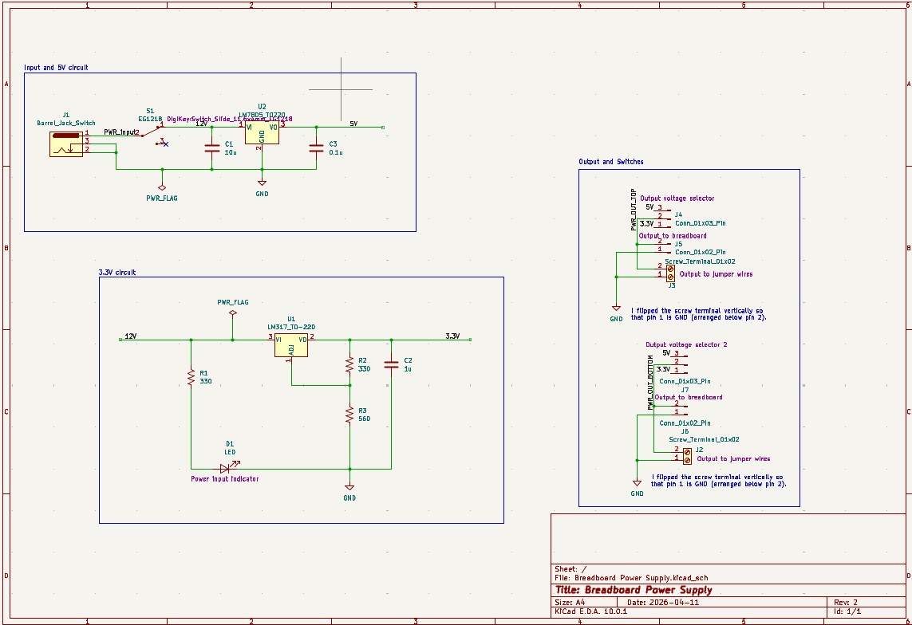
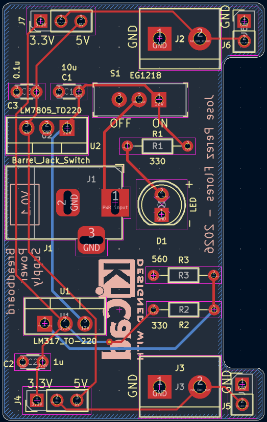
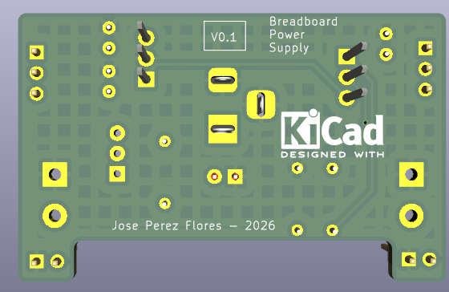
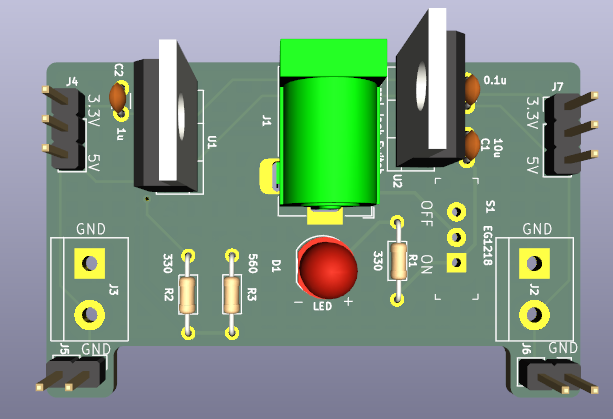

# Breadboard Power Supply

A dual-output regulated power supply PCB designed to sit across a breadboard and provide selectable **3.3V and 5V** rails. Built as a learning project using KiCad.

---

## Specifications

| Parameter | Value |
|---|---|
| Input Voltage | 12V DC (barrel jack) |
| Output Voltages | 3.3V / 5V (selectable per rail) |
| 5V Regulator | LM7805 (TO-220) |
| 3.3V Regulator | LM317 (TO-220) |
| Output Connectors | 2.54mm pin headers + screw terminals |
| Board Revision | V0.1 |

---

## Schematic

The design is split into three sections:

- **Input and 5V circuit** — 12V enters through a barrel jack with an EG1218 slide switch. The LM7805 regulates it down to 5V with 10µF and 0.1µF decoupling caps.
- **3.3V circuit** — The LM317 is configured with an R1=330Ω, R2=330Ω, R3=560Ω resistor network to output 3.3V. A power indicator LED is included on the input rail.
- **Output and switches** — Each side of the board (top and bottom breadboard rails) has a 3-pin voltage selector header (3.3V or 5V), a 2-pin breadboard connector, and a screw terminal for jumper wire output.

---

## PCB Layout

---

## 3D Render

---

## Features

- Dual independent output rails — each side of the breadboard gets its own voltage selector
- Selectable 3.3V or 5V per rail via jumper header
- Power indicator LED on input
- Screw terminal outputs for jumper wire connections
- Compact form factor sized to straddle a standard breadboard

---

## Tools Used

- KiCad EDA 10.0.1
- KiCad built-in symbol and footprint libraries

---

## Design Notes

This was my first complete PCB layout from schematic to fabrication-ready files. A few things I paid attention to:

- The LM317 output voltage is set by the ratio of R2 and R3 (330Ω / 560Ω), following the standard adjust-pin formula: V_out = 1.25 × (1 + R2/R1)
- Decoupling capacitors are placed close to regulator output pins to suppress noise
- The screw terminals are flipped vertically so that pin 1 is GND (arranged below pin 2) for intuitive polarity

---

## Acknowledgements

Designed alongside a tutorial as an introduction to KiCad PCB design and linear voltage regulators.

---

*Jose Perez Flores — 2026*
